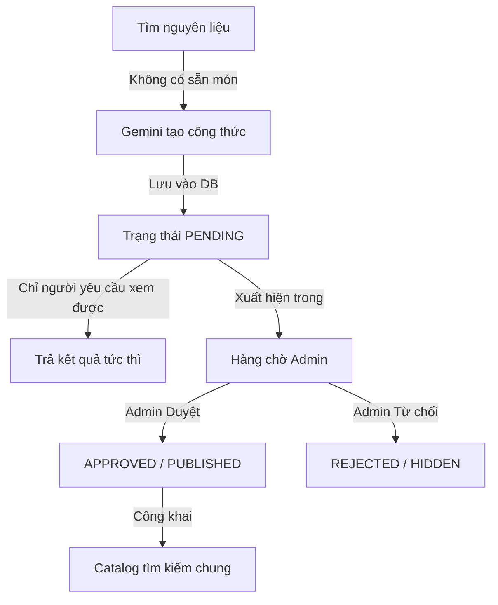

# Tài liệu Module Quản trị (Admin Module) - Giai đoạn 6

Tài liệu này giải thích chi tiết về **ý nghĩa nghiệp vụ**, **kiến trúc thiết kế** và **luồng hoạt động** của Giai đoạn 6 (Admin Module) trong hệ thống **Ăn Gì Giờ?**.

---

## 1. Ý nghĩa và Bối cảnh Nghiệp vụ

Trong một hệ thống sử dụng Trí tuệ Nhân tạo (Gemini AI) để tạo nội dung động như **Ăn Gì Giờ?**, Module Admin đóng vai trò là **chốt chặn kiểm soát chất lượng và bảo mật**. Ý nghĩa của Phase 6 xoay quanh 3 trụ cột chính:

### Trụ cột 1: Đóng vòng lặp Gemini Fallback (AI Moderation)
* **Vấn đề**: Ở Giai đoạn 2, khi người dùng tìm kiếm nguyên liệu mà database không có sẵn, Gemini AI sẽ tự động sinh công thức mới và lưu vào cơ sở dữ liệu dưới trạng thái kiểm duyệt `PENDING`.
* **Ý nghĩa của Phase 6**: 
  - Nếu không có module Admin, các công thức do AI tạo ra sẽ mãi mãi nằm ở trạng thái `PENDING` và không bao giờ được đưa vào catalog công khai. Điều này làm lãng phí tài nguyên sinh AI và hạn chế sự phát triển tự động của catalog.
  - Phase 6 cung cấp cơ chế để Admin duyệt (`approve`) đưa công thức AI ra công chúng hoặc từ chối (`reject`) ẩn chúng đi nếu nội dung không đảm bảo chất lượng/an toàn thực phẩm.



### Trụ cột 2: Vận hành Nội dung (Content Management)
* **Ý nghĩa**: Cho phép Admin thực hiện các thao tác CRUD cơ bản (`Create`, `Read`, `Update`, `Delete`) trực tiếp qua API thay vì thao tác thủ công vào database.
* Admin có thể sửa đổi nội dung của công thức (các bước nấu, lượng nguyên liệu, mẹo nấu ăn) để tối ưu hóa trải nghiệm người dùng trước hoặc sau khi xuất bản.
* Chế độ xóa mềm (Soft Delete) chuyển `status` sang `HIDDEN` thay vì xóa vật lý khỏi database để bảo toàn dữ liệu lịch sử nấu ăn (`cooking_sessions`) và danh sách lưu món (`saved_recipes`) của người dùng.

### Trụ cột 3: Bảo an Hệ thống và Người dùng (User Moderation)
* **Ý nghĩa**: Cho phép Admin can thiệp khi có tài khoản người dùng vi phạm tiêu chuẩn cộng đồng hoặc spam hệ thống.
* Khi tài khoản bị chuyển sang trạng thái `BLOCKED`:
  - Token cũ của người dùng ngay lập tức bị vô hiệu hóa tại middleware do hệ thống kiểm tra trạng thái tài khoản thực tế trong DB ở mỗi request.
  - Người dùng bị chặn đăng nhập và sử dụng các tính năng cá nhân hóa (saved recipes, cooking, chat Phụ Bếp).

---

## 2. Kiến trúc và Quyết định Thiết kế Kỹ thuật

### 2.1 Nhật ký quản trị (Audit Logging) để đảm bảo tính minh bạch
* **Vấn đề**: Khi có nhiều Admin hoặc khi xảy ra sự cố dữ liệu (ví dụ: công thức bị xóa nhầm, tài khoản bị khóa sai), rất khó để truy vết người thực hiện hành động.
* **Giải pháp**: Bảng `admin_audit_logs` ghi lại chi tiết:
  - Admin nào thực hiện hành động (`admin_user_id`).
  - Hành động cụ thể là gì (`action` - ví dụ: `APPROVE_RECIPE`, `BLOCK_USER`).
  - Tác động lên thực thể nào (`entity_type`, `entity_id`).
  - Dữ liệu chi tiết trước/sau thay đổi (`metadata` dạng JSONB).
* **Tác dụng**: Giúp hệ thống dễ dàng audit, phát hiện hành vi lạm quyền hoặc hỗ trợ khôi phục dữ liệu khi cần thiết.

### 2.2 Bảo mật Route-Level nghiêm ngặt
* Route admin được bảo vệ kép qua hai middleware:
  1. `authenticate`: Xác thực JWT hợp lệ của người dùng.
  2. `requireRole('ADMIN')`: Kiểm tra role của người dùng có khớp với giá trị `'ADMIN'` hay không.
* Việc kiểm tra quyền hạn được thực hiện ở tầng Backend thay vì chỉ ẩn nút trên giao diện Client, triệt tiêu nguy cơ hacker gọi trực tiếp API bằng các công cụ như Postman/Curl.

### 2.3 Ràng buộc Tự khóa tài khoản (Self-Blocking Guard)
* Ở tầng Service (`AdminService`), hệ thống chặn hành vi Admin tự khóa tài khoản của chính mình (`adminUserId === targetUserId`). Điều này ngăn chặn tình huống Admin duy nhất của hệ thống vô tình tự khóa tài khoản, dẫn đến việc hệ thống không còn quản trị viên hoạt động.

---

## 3. Cấu trúc Schema & Migration mới

Bảng nhật ký Admin được lưu trữ thông qua migration [005_admin_audit_log.sql](file:///d:/FPT/SDN/Eat/be-an-gi-gio/database/migrations/005_admin_audit_log.sql):

```sql
CREATE TABLE IF NOT EXISTS admin_audit_logs (
  id              UUID PRIMARY KEY DEFAULT gen_random_uuid(),
  admin_user_id   UUID NOT NULL REFERENCES app_users(id) ON DELETE CASCADE,
  action          VARCHAR(100) NOT NULL,
  entity_type     VARCHAR(50)  NOT NULL,
  entity_id       UUID         NOT NULL,
  metadata        JSONB        NOT NULL DEFAULT '{}',
  created_at      TIMESTAMPTZ  NOT NULL DEFAULT NOW()
);
```

### Các hành động được ghi vết (Action Enum):
- `CREATE_RECIPE`: Tạo công thức thủ công.
- `UPDATE_RECIPE`: Cập nhật thông tin công thức.
- `DELETE_RECIPE`: Ẩn công thức (soft delete).
- `APPROVE_RECIPE`: Duyệt công thức AI từ PENDING sang APPROVED.
- `REJECT_RECIPE`: Từ chối công thức AI từ PENDING sang REJECTED.
- `BLOCK_USER`: Khóa tài khoản người dùng.
- `UNBLOCK_USER`: Mở khóa tài khoản người dùng.

---

## 4. Gợi ý tích hợp với Frontend (Dành cho FE developer)

Khi xây dựng giao diện quản trị Admin trên Frontend, lập trình viên cần lưu ý:
1. **Lưu Token**: Gửi kèm `Authorization: Bearer <JWT_TOKEN>` trong header của mỗi request gọi đến `/api/v1/admin/*`.
2. **Quy trình duyệt (Moderation UI)**:
   - Hiển thị danh sách các công thức có nhãn `source = GEMINI` và `moderationStatus = PENDING`.
   - Cung cấp hai nút hành động: **Phê duyệt** (gọi `POST /api/v1/admin/recipes/:id/approve`) và **Từ chối** (gọi `POST /api/v1/admin/recipes/:id/reject`).
3. **Quản trị người dùng**:
   - Hiển thị danh sách người dùng kèm trạng thái (`ACTIVE` / `BLOCKED`).
   - Nút chuyển đổi trạng thái (toggle) gọi `PATCH /api/v1/admin/users/:id/status` kèm body `{"status": "BLOCKED"}` hoặc `{"status": "ACTIVE"}`.
