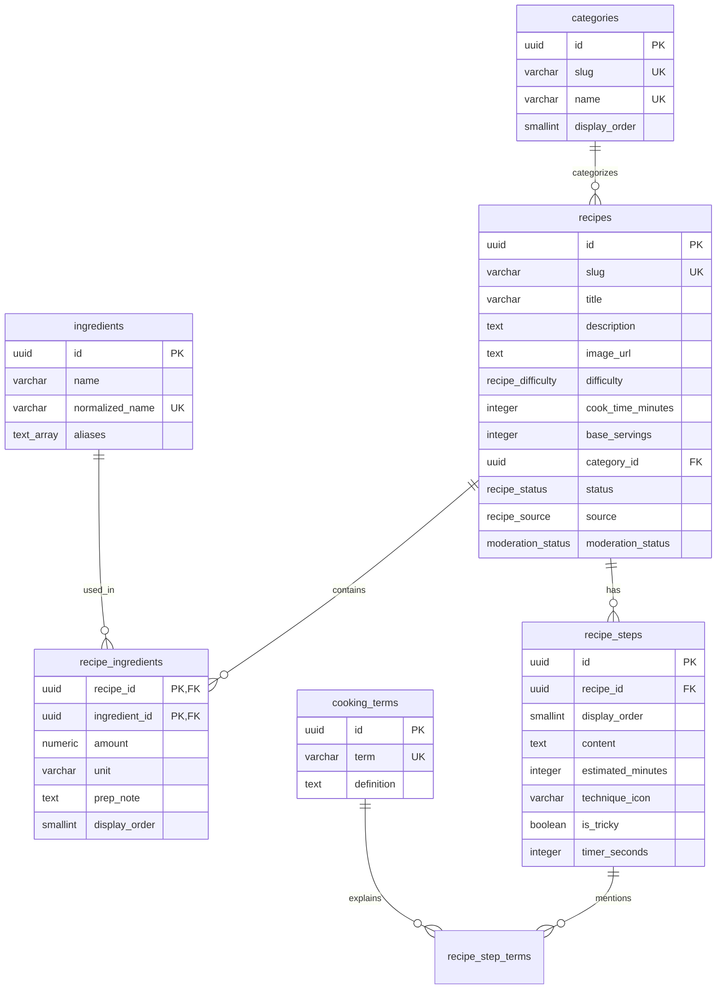

# ERD — Recipe catalog

```mermaid
erDiagram
  categories ||--o{ recipes : categorizes
  recipes ||--o{ recipe_ingredients : contains
  ingredients ||--o{ recipe_ingredients : used_in
  recipes ||--o{ recipe_steps : has
  recipe_steps ||--o{ recipe_step_terms : mentions
  cooking_terms ||--o{ recipe_step_terms : explains

  categories {
    uuid id PK
    varchar slug UK
    varchar name UK
    smallint display_order
  }

  recipes {
    uuid id PK
    varchar slug UK
    varchar title
    text description
    text image_url
    recipe_difficulty difficulty
    integer cook_time_minutes
    integer base_servings
    uuid category_id FK
    recipe_status status
    recipe_source source
    moderation_status moderation_status
  }

  ingredients {
    uuid id PK
    varchar name
    varchar normalized_name UK
    text_array aliases
  }

  recipe_ingredients {
    uuid recipe_id PK,FK
    uuid ingredient_id PK,FK
    numeric amount
    varchar unit
    text prep_note
    smallint display_order
  }

  recipe_steps {
    uuid id PK
    uuid recipe_id FK
    smallint display_order
    text content
    integer estimated_minutes
    varchar technique_icon
    boolean is_tricky
    integer timer_seconds
  }

  cooking_terms {
    uuid id PK
    varchar term UK
    text definition
  }
```
